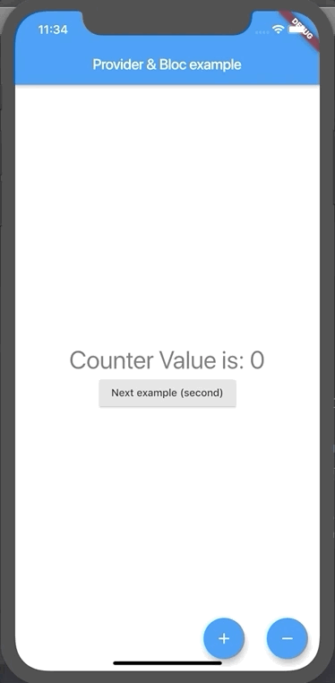

# flutter_provider_example
Hello! 
This is for beginners who are starting to study 'Provider', 'Bloc pattern' 
플러터 초보자를 위한, Provider사용법과 Bloc패턴 예제입니다.
   
<h2> FirstScreen </h2>
The simple counter screen using Provider

 
<h2> SecondScreen </h2>
The MultiProvider example

 
<h2> ThirdScreen </h2>
The Listview using Provider

 
<h2> FourthScreen </h2>
The Listview using Rxdart, Stream 
I wanted to make loading indicator using just one stream(list stream), but i couldn't do that. 
If use 'ConnectionState.done' it must close the stream. 
But, I think opening and closing the stream often is not efficient. 
If there is a good way please let me know. 
Thanks.

